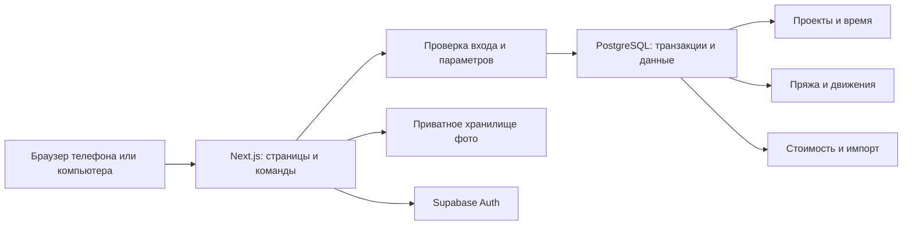

# Архитектура

> Первоначальный проект веб-версии. С 30 сентября 2026 локальная реализация использует Electron и SQLite; актуальное решение описано в [desktop.md](desktop.md). PostgreSQL/Supabase ниже относятся к исходному плану.

## Подход

Одно веб-приложение с модулями проектов, пряжи, учета времени, стоимости и импорта. Отдельные микросервисы и очередь задач для первой версии не нужны. Бизнес-правила остатков выполняются в транзакциях базы, а не в браузере.

Предлагаемый стек:

| Часть | Решение | Причина |
| --- | --- | --- |
| Интерфейс и серверные обработчики | Next.js App Router + TypeScript | Один проект для страниц и команд приложения |
| База | PostgreSQL в Supabase | Связи изделий и материалов, транзакции, ограничения |
| Вход | Supabase Auth, закрытая регистрация на старте | Один личный аккаунт сейчас, независимые аккаунты позже |
| Фотографии | Приватный Supabase Storage | Файлы отдельно от табличных данных, доступ владельца |
| Работа с данными | Supabase SDK, сгенерированные типы БД, SQL-миграции | Без дополнительного ORM; критические операции через функции БД |
| Проверки | Модульные тесты расчетов, интеграционные тесты PostgreSQL, браузерные сценарии | Наибольший риск — двойные списания, таймер и импорт |

Это проектное предложение, а не уже развернутая инфраструктура. Тариф, регион хранения и размещение Next.js выбираются перед публикацией. Вариант размещения — управляемый Node.js-хостинг; при необходимости своего сервера сохраняем приложение и PostgreSQL, заменяем адаптеры входа/файлов. Такая замена потребует работы.

Документация: [Next.js App Router](https://nextjs.org/docs/app), [Supabase SSR Auth](https://supabase.com/docs/guides/auth/server-side/creating-a-client?queryGroups=framework&framework=nextjs), [функции PostgreSQL через Supabase](https://supabase.com/docs/guides/database/functions).



## Шаблон, проект, готовое изделие

Шаблон — повторяемая модель: описание, категория, плановые материалы, ориентир времени и цены. Проект — конкретное изготовление, со своими фотографиями, датами, сеансами работы, фактическим расходом и ценами.

Завершение проекта делает его видимым в каталоге. Вторую независимую запись «готовое изделие» не создаем: иначе придется синхронизировать два описания одной вещи.

Проект может содержать партию одинаковых вещей. Все фактические расходы и длительности внутри системы относятся ко всей партии. Поля «на штуку» — способ ввода/отображения. При смене количества уже введенные фактические итоги не умножаются автоматически. Для раздельных дат и получателей удобнее отдельные проекты.

Статусы: `planned → active ↔ paused → completed`; незавершенный проект можно отменить. Завершенный можно вновь открыть. Отмена и повторное открытие сами по себе не возвращают пряжу. Архивирование скрывает проект, сохраняя его связи и историю. Физическое удаление допустимо только для пустого черновика.

## Пряжа и остатки

Три уровня:

1. Продукт: производитель, название, состав, стандартные граммы и метры на моток.
2. Цвет: название, код цвета, личный номер позиции.
3. Поступление: дата, партия окрашивания, фактически полученный вес, количество мотков, стоимость, снимок характеристик этикетки.

Один цвет может иметь несколько покупок с разной ценой. Изменение описания продукта не пересчитывает старые поступления.

Источник истины — неизменяемый журнал `stock_movements`. Остаток поступления равен сумме его движений. Для личного объема этого достаточно; отдельный обновляемый счетчик остатков пока не нужен.

Типы движений: `opening`, `receipt`, `consumption`, `return`, `adjustment`, `reversal`. Вес — десятичное число граммов. Корректировки требуют причину. Ошибочная операция исправляется связанным обратным движением и новой записью.

Пример: поступило 500 г, на шапку внесли расход 80 г — осталось 420 г. Расход исправили на 95 г — осталось 405 г. Повтор сохранения и завершение проекта оставляют 405 г. Купили еще 200 г — общий остаток 605 г, но новая покупка хранится отдельно.

Метраж = остаток в граммах × метры полного мотка / граммы полного мотка. Это оценка по этикетке; без метража результат неизвестен. Сумму метров считаем по поступлениям, а не по одной общей плотности.

### Списание

В проекте выбирается цвет и вводится фактический расход. Пользователь может выбрать поступления; по умолчанию приложение предлагает самые ранние доступные поступления этого цвета (FIFO), показывая разбиение до сохранения. Разные партии окрашивания явно отображаются, автоматическая замена цвета запрещена.

Команда `set_project_consumption` принимает целевое общее количество по строке расхода, ее версию и уникальный ключ запроса. База в одной транзакции:

1. Проверяет владельца и статус проекта, блокирует проект и затрагиваемые поступления в стабильном порядке UUID.
2. Проверяет повтор команды и версию записи.
3. Читает текущие движения и вычисляет разницу с целевым расходом.
4. При увеличении распределяет дополнительный вес; при уменьшении возвращает ранее списанный вес из последних распределений, сохраняя их цены.
5. Проверяет неотрицательные остатки и записывает распределения, движения и результат команды.

Все операции остатков, включая покупки и корректировки, используют те же блокировки. Повтор с тем же ключом и телом возвращает прежний результат; тот же ключ с другим телом отклоняется. Устаревшая версия возвращает конфликт для обновления формы.

При изменении нескольких строк одной кнопкой сохранения они обрабатываются одной транзакцией. Недостаток хотя бы одной позиции откатывает все изменения.

Прямые изменения журнала клиентом запрещены. [Блокировки строк PostgreSQL](https://www.postgresql.org/docs/current/explicit-locking.html) нужны, чтобы два устройства не потратили один остаток одновременно.

### Возврат и архив

Возврат при распускании — отдельное действие с фактически восстановленным весом; он не может превышать еще не возвращенный расход данного распределения. Расход на проект уменьшается на возврат. Сам факт отмены проекта не означает, что пряжа физически восстановлена.

Использованное поступление нельзя удалить или менять задним числом. Ошибки исправляются операцией с причиной. Архив проекта и скрытие нулевой пряжи не влияют на банк.

Резервирование — следующий этап: резерв не является расходом; «доступно» = «остаток» − «резерв». Его нельзя реализовать тем же типом движения, что списание.

## Время и даты

Сеанс таймера хранит серверные `started_at` и `ended_at`. Браузер только отображает разницу времени; сохранение ежесекундного счетчика не требуется. Сеанс продолжается при закрытой вкладке до явной остановки. При возвращении пользователь видит время и может исправить забытый сеанс. Запуск и остановка требуют сети; офлайн-синхронизация отложена.

Частичный уникальный индекс разрешает один незакрытый сеанс на пользователя. Все команды таймера и перехода статуса блокируют профиль пользователя, затем проект, затем поступления (если нужны). Начать другой проект при активном таймере можно командой переключения: закрыть старый и открыть новый одной транзакцией.

Первый запуск переводит запланированный проект в работу и предлагает дату начала в часовом поясе пользователя. «Пауза» таймера закрывает сеанс, но не переводит весь проект в статус «приостановлен». Действие «Приостановить проект» закрывает таймер и меняет статус.

Завершение проекта атомарно закрывает его активный таймер, фиксирует дату завершения, проверяет полноту материалов и обновляет итог стоимости. Уже внесенный расход повторно не списывается. Повторное открытие сохраняет сеансы и движения, убирает текущую дату завершения; старое значение остается в истории.

Ручная запись — интервал с началом/концом либо длительность с необязательной датой. Историческое число часов не превращается в искусственный интервал. Интервалы пользователя не должны пересекаться; для записей только с длительностью проверить пересечение нельзя, интерфейс сообщает об этом. Исправления сохраняют автора, причину и прежнее значение.

Календарные даты проекта — `date`; сеансы — `timestamptz` в UTC. Часовой пояс в профиле. Неизвестная дата остается пустой. Для импорта месяца храним точность `month`, не выдаем первое число за реальную дату окончания.

## Стоимость

Цена грамма поступления = стоимость всего поступления / полученные граммы. Стоимость расхода считается по выбранным поступлениям и фиксируется в распределениях. Новая покупка по другой цене не меняет стоимость старых изделий.

- Материалы = стоимость пряжи после возвратов + дополнительные материалы.
- Работа = суммарные секунды / 3600 × ставка проекта.
- Полная расчетная стоимость = материалы + работа.
- Назначенная цена задается независимо, за одну штуку.

Ставка копируется из настроек при создании проекта. Изменение ставки по умолчанию не меняет прошлые проекты. В Excel ставка зашита в формулах; при импорте она становится явным полем.

Вес и цены за грамм храним как PostgreSQL `numeric`; деньги — `numeric` с валютой RUB, не двоичный float. Промежуточные расчеты не округляем до копеек, округление делаем на итогах. Время — целые секунды. Отсутствие цены и явно нулевая цена различаются.

Без полной стоимости хотя бы одного материала показываем известную часть и пометку «расчет неполный». Для завершенного проекта сохраняем версию итогового расчета. Исправление расхода/времени создает новую версию с причиной.

Исторический расчет из Excel сохраняется отдельно от расчета по новым правилам. Его нельзя без объяснения подменять стоимостью сегодняшней пряжи.

## API и границы модулей

Чтение: проекты, карточка проекта, каталог, остатки по цветам/поступлениям, движения, сеансы. Все выборки фильтруются по владельцу, списки имеют пагинацию.

Команды приложения: `create_project`, `repeat_project`, `change_project_status`, `receive_yarn`, `set_project_consumption`, `return_yarn`, `adjust_stock`, `start_timer`, `stop_timer`, `switch_timer`, `save_manual_time`, `complete_project`, `preview_import`, `commit_import`.

Next.js валидирует запрос и передает пользовательский контекст в функцию БД. У критических команд обязательны ключ идемпотентности и ожидаемая версия объекта. Результат содержит новые остатки, версию и актуальные итоги. Валидационные ошибки, нехватка запаса и конфликт версии различаются.

Будущая структура исходников:

```text
src/app/                 страницы и серверные обработчики
src/features/projects/   формы и представления проектов
src/features/yarn/       пряжа, покупки, расход
src/features/time/       таймер и журнал работы
src/features/costs/      отображение расчетов
src/features/import/     просмотр и подтверждение переноса
src/lib/                 вход, клиент БД, общая валидация
supabase/migrations/     таблицы, функции, ограничения, политики доступа
tests/                   расчеты, транзакции, браузерные сценарии
```

Эта структура описана для следующего этапа; пустые исходники приложения сейчас не создаются.

## Доступ, фотографии и восстановление

На каждой пользовательской сущности есть `owner_id`. RLS ограничивает чтение владельцем. Связи между таблицами также проверяют владельца. Для критических таблиц прямые INSERT/UPDATE/DELETE для пользователя отозваны: запись только через узкие функции с проверкой `auth.uid()`. Если функции используют `SECURITY DEFINER`, задается пустой `search_path`, используются полные имена таблиц, EXECUTE отзывается у PUBLIC/anon. Сервисный ключ не передается браузеру.

Файлы приватные, путь включает UUID владельца. Подписанные ссылки выдаются после проверки владельца. Проверяем размер и действительный тип изображения; создаем уменьшенные копии и удаляем EXIF с координатами. HEIC требует конвертации в поддерживаемый формат. Загрузка имеет состояния pending/ready; неудачный файл не создает готовую фотографию. Осиротевшие загрузки удаляются отдельной обслуживающей процедурой.

Основа: [RLS](https://supabase.com/docs/guides/database/postgres/row-level-security) и [доступ к Storage](https://supabase.com/docs/guides/storage/security/access-control).

Резервирование данных: регулярный дамп базы и отдельная копия файлов; перед первым реальным использованием — проверка восстановления в чистое окружение. Экспорт пользователя: JSON с версией схемы и архив фотографий; CSV для ручного анализа. Облачная резервная копия базы сама по себе не считается копией фотографий.

## Границы решения

Личный учет, один банк на владельца; сеть необходима для изменений. Совместные команды, публикация каталога, платежи, несколько валют, полноценный бухгалтерский учет и офлайн-конфликты требуют отдельных решений. Публикация приложения и покупка сервисов в этот этап не входят.
