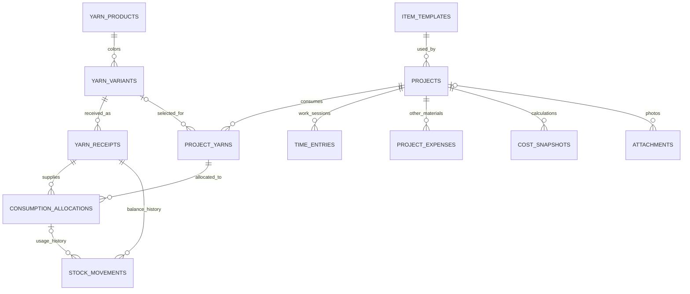

# Модель данных

> Исходная логическая модель. Исполняемая схема локальной версии находится в `db/sqlite/001_initial.sql`, правила хранения целых единиц описаны в [desktop.md](desktop.md).

Логическая схема для реализации, не исполняемая SQL-миграция. Таблицы первой версии перечислены ниже; резервирование и продажи отмечены отдельно.

## Общие соглашения

Первичные ключи UUID. Пользовательские таблицы содержат `owner_id`, `created_at`, `updated_at`; изменяемые корневые записи — `version`. Журналы неизменяемы, время записи отделено от даты хозяйственной операции. Внешние ключи пользовательских сущностей составные `(owner_id, id)`, чтобы нельзя было связать записи разных владельцев.

Граммы: `numeric(14,3)`, длины: `numeric(14,3)`, суммы денег: `numeric(14,2)`, цена за грамм: `numeric(20,10)`. Длительности: целые секунды. Коды цветов и личные номера: `text`. Пустое значение означает неизвестность, а не ноль.

## Таблицы

| Таблица | Основные поля | Назначение |
| --- | --- | --- |
| `profiles` | id → auth user, timezone, currency, default_hourly_rate | Владелец и настройки |
| `categories` | id, owner_id, name, archived_at | Категории изделий |
| `item_templates` | id, category_id, name, technique, description, measurements_json, tools_json, planned_seconds_per_unit, planned_other_material_cost nullable, hourly_rate, suggested_unit_price | Повторяемая модель |
| `template_materials` | id, template_id, yarn_variant_id nullable, description, planned_grams_per_unit, estimated_cost_per_gram nullable | Плановые материалы; не изменяют остаток |
| `projects` | id, template_id nullable, category_id, title, description, technique, measurements_json, tools_json, quantity, purpose, status, start_date nullable, end_date nullable, start_precision, end_precision, hourly_rate_snapshot, assigned_unit_price nullable, archived_at | Изготовление одной вещи или партии |
| `project_events` | id, project_id, actor_id, event_type, previous_value_json, new_value_json, reason, recorded_at | История статусов и изменений |
| `yarn_products` | id, manufacturer, name, composition_text, composition_json nullable, skein_weight_g, skein_length_m nullable | Характеристики пряжи |
| `yarn_variants` | id, product_id, color_name, color_code nullable, personal_code nullable, archived_at | Цвет и личный номер |
| `yarn_receipts` | id, variant_id, received_on, receipt_kind, dye_lot nullable, storage_location, initial_weight_g, skein_count nullable, skein_weight_g_snapshot, skein_length_m_snapshot nullable, total_cost nullable, currency, cost_status, note | Поступление/начальный остаток и зафиксированные характеристики |
| `project_yarns` | id, project_id, variant_id nullable, description_snapshot, planned_grams nullable, declared_total_grams nullable, accounting_mode, source_ref nullable | Строка материала, план и учетный режим |
| `consumption_allocations` | id, project_yarn_id, receipt_id, allocated_grams, unit_cost_snapshot nullable, operation_id | Первичное распределение расхода на поступление; возвраты отражаются движениями |
| `stock_movements` | id, receipt_id, allocation_id nullable, operation_id, type, signed_grams, effective_on, recorded_at, reverses_id nullable, reason | Журнал, из которого рассчитываются остатки |
| `project_expenses` | id, project_id, label, quantity, unit, total_cost nullable, currency, note | Дополнительные материалы без отдельного склада |
| `time_entries` | id, project_id, kind, started_at nullable, ended_at nullable, manual_seconds nullable, work_date nullable, entry_state, note | Сеанс таймера или ручная длительность |
| `time_entry_revisions` | id, entry_id, before_json, after_json, reason, actor_id, recorded_at | Исправления времени |
| `cost_snapshots` | id, project_id, revision, materials_total nullable, labor_total, full_total nullable, known_materials_subtotal, completeness, calculation_basis_json, source | Версии расчетов; historical и application различаются |
| `attachments` | id, project_id nullable, variant_id nullable, template_id nullable, storage_key, thumbnail_key nullable, media_type, byte_size, sort_order, is_cover, state | Фото, ровно один родитель |
| `operations` | id, owner_id, idempotency_key, command, payload_hash, result_json, recorded_at | Защита команд от повторного выполнения |
| `import_batches` | id, source_hash, source_name, parser_version, accounting_mode, status, report_json | Сеанс импорта |
| `import_rows` | id, batch_id, sheet_name, source_range, record_type, normalized_json, issues_json, target_id nullable, state | Подготовка и сопоставление строк |

`composition_text` обязателен для полноты новой карточки, но импорт может оставить его неизвестным с пометкой. Структурный состав позволяет позже искать по волокнам. Отсутствующие характеристики старой пряжи не выдумываются.

`project_yarns.accounting_mode`: `tracked` — влияет на банк через движения; `historical` — хранит ранее учтенный расход без списания. У исторической строки связь с цветом может быть неизвестна. Режим нельзя менять обычным редактированием: нужна специальная сверка, иначе возникает повторное списание.

У tracked-строки фактический расход вычисляется по связанным списаниям минус возвраты; `declared_total_grams` не является вторым источником истины. Для historical-строки оно хранит известный общий расход без распределения по складу. Плановые граммы всегда относятся ко всему проекту.

Ручное время имеет `kind=manual`, положительные `manual_seconds`, пустые timestamp-поля; таймер имеет `kind=timer`, время начала и необязательное время конца. Для ручного ввода интервала используется `kind=interval`, обе временные отметки обязательны. Удаление ошибочной записи — `entry_state=void` с ревизией, а не потеря истории.

## Связи

## Ограничения и индексы

- `projects.quantity > 0`, целое; цена и ставка неотрицательны; неизвестная цена nullable.
- Вес и длина полного мотка положительны, если известны. Начальное поступление неотрицательно; нулевое допустимо только как пустой начальный остаток без нулевого движения.
- `UNIQUE(owner_id, idempotency_key)` в operations.
- Частичный `UNIQUE(owner_id)` в time_entries для действующего timer с `ended_at IS NULL`.
- `ended_at >= started_at`; закрытая длительность неотрицательна. Сеанс нулевой длительности не добавляет время.
- Даты завершения не раньше начала при известной дневной точности. При месячной точности проверяется совместимость диапазонов.
- CHECK: у attachments ровно один из parent-id заполнен. Одна готовая обложка на родителя — частичный unique index.
- Индексы `(owner_id, status, updated_at)` для проектов, `(owner_id, category_id)`, `(owner_id, variant_id, received_on)` для поступлений, `(owner_id, receipt_id, recorded_at)` для движений, `(owner_id, project_id, started_at)` для времени.
- Направление движения проверяется по type: receipt/opening/return положительные, consumption отрицательное, adjustment/reversal со знаком. Нулевые движения не создаются.
- Остаток по сумме строк не проверяется обычным CHECK: его гарантируют транзакционные функции с блокировкой receipt.
- Сумма возвратов не превышает расход распределения; возврат связан с тем же receipt и owner.
- Ссылки из истории запрещают каскадное удаление использованных проектов и поступлений.
- Для повторного импорта: уникальная идентичность исходной строки в пределах владельца, hash файла и диапазон. Измененный файл проходит сопоставление, а не слепую вставку.

## Расчетные представления

`receipt_balances`: SUM движений по поступлению. `variant_balances`: сумма граммов и расчетных метров по поступлениям цвета. `project_actual_usage`: расход минус возвраты. `project_work_totals`: сумма действующих закрытых сеансов, интервалов и ручных длительностей. Активное время отображается отдельно и добавляется только для текущего показателя.

`completed_projects` — представление/запрос проектов со статусом completed. В отчетах отдельно считаются число проектов и SUM(quantity), чтобы партия из семи вещей не считалась одной вещью.

Все представления обязаны сохранять ограничения владельца; в PostgreSQL использовать security-invoker view либо проверенные функции чтения. Агрегат не должен обходить RLS.

## Будущие сущности

- `yarn_reservations`: project, receipt/variant, граммы, состояние. Не создает расход.
- `sales` и `sale_items`: дата, покупатель (необязательно), конкретный проект, количество, фактическая цена, версия себестоимости. Нельзя продать больше доступного количества изготовленных вещей.
- При необходимости отдельных серийных изделий — `project_outputs`. Для первого личного учета достаточно quantity и отдельных проектов для различающихся экземпляров.
